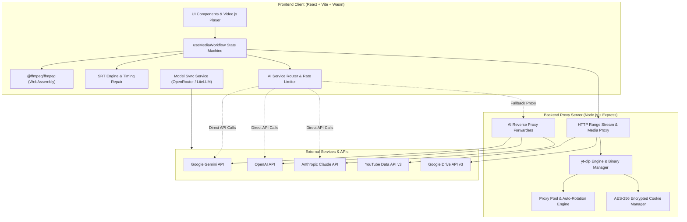

# SubStream AI

SubStream AI is an advanced, high-performance subtitle extraction, speech-to-text transcription, context-aware translation, and video muxing suite. Built with React, TypeScript, Vite, and client-side WebAssembly FFmpeg alongside a Node.js companion proxy server, SubStream AI enables private, browser-first media processing with seamless integrations across major AI providers (Google Gemini, OpenAI, Anthropic Claude, OpenRouter) and cloud platforms (YouTube, Google Drive).


---

## Table of Contents

- [Overview](#substream-ai)
- [Key Features](#key-features)
- [Architecture Overview](#architecture-overview)
- [Tech Stack & Exact Versions](#tech-stack--exact-versions)
  - [Frontend Stack](#frontend-stack)
  - [Backend & Proxy Server Stack](#backend--proxy-server-stack)
- [Core Technologies & Methodologies](#core-technologies--methodologies)
  - [1. Subtitle Processing & Timing Algorithms](#1-subtitle-processing--timing-algorithms)
  - [2. Multi-Provider AI Translation & Transcription](#2-multi-provider-ai-translation--transcription)
  - [3. Dynamic AI Model Catalog Synchronization](#3-dynamic-ai-model-catalog-synchronization)
  - [4. Client-Side Media Processing (WebAssembly FFmpeg)](#4-client-side-media-processing-webassembly-ffmpeg)
  - [5. Cloud Integrations (YouTube & Google Drive)](#5-cloud-integrations-youtube--google-drive)
  - [6. Backend Proxy & Media Engine](#6-backend-proxy--media-engine)
- [Project Structure](#project-structure)
- [Getting Started & Local Development](#getting-started--local-development)
  - [Prerequisites](#prerequisites)
  - [Installation](#installation)
  - [Running the Frontend](#running-the-frontend)
  - [Running the Backend Proxy Server](#running-the-backend-proxy-server)
- [Environment Configuration](#environment-configuration)
  - [Frontend Environment Variables](#frontend-environment-variables)
  - [Backend Environment Variables](#backend-environment-variables)
- [Deployment](#deployment)
  - [Building for Production](#building-for-production)
  - [Deploying to GitHub Pages](#deploying-to-github-pages)
- [License](#license)

---

## Key Features

- **Context-Aware Batch Translation:** Intelligently batches subtitle segments to preserve narrative continuity, conversational flow, grammatical gender, and tone across line breaks.
- **Multimodal AI Speech-to-Text:** Directly transcribes audio streams into synchronized SRT subtitle segments using Google Gemini multimodal audio prompts or OpenAI Whisper.
- **Multi-Provider AI Support:** Seamless switching between Google Gemini (Gemini 2.5 Flash, Gemini 3 Pro), OpenAI (GPT-4o, GPT-4o-mini, Whisper-1), and Anthropic Claude (Claude 3.5 Sonnet, Claude 3.5 Haiku, Claude 3.7 Sonnet).
- **Dynamic Model Catalog Synchronization:** Automatically synchronizes available text models and pricing data in real-time from OpenRouter and LiteLLM APIs with localStorage fallback caching.
- **Client-Side Media Engine (Wasm FFmpeg):** Performs audio extraction, subtitle extraction, and video remuxing directly inside the browser using WebAssembly without uploading video files to intermediate servers.
- **Cloud & Media Import:** Direct media extraction from YouTube URLs, user-authenticated YouTube account uploads/downloads via OAuth 2.0, and Google Drive picker integration.
- **Resilient Proxy & Streaming Backend:** Companion Express proxy featuring automated Windows registry and local port proxy detection, automated public proxy pool rotation, Range-header media streaming, and AES-256-CBC encrypted cookie management.
- **Interactive Video Player & Subtitle Editor:** Integrated Video.js player with real-time subtitle overlay, live dual-pane text editing, search, and synchronized playback previews.
- **Rate-Limiting & Quota Management:** Built-in sliding window rate limiters and exponential backoff retry algorithms to handle API quota caps and HTTP 429 responses smoothly.

---

## Architecture Overview

SubStream AI is designed around a privacy-first, dual-layer architecture:

1. **Frontend Client (Browser):** Handles the user interface, video playback, WebAssembly FFmpeg media processing, SRT parsing, state orchestration, and direct communication with AI providers whenever possible.
2. **Backend Companion Server (Node.js/Express):** Manages heavy tasks requiring native tools (`yt-dlp`, `ffmpeg-static`), bypasses cross-origin restrictions (CORS), proxies Google Drive/YouTube media streams with HTTP Range support, and acts as an optional transparent fallback proxy for AI APIs in restricted network environments.



---

## Tech Stack & Exact Versions

### Frontend Stack

| Technology / Library | Exact Version | Link | Purpose / Description |
| :--- | :--- | :--- | :--- |
| **React** | `^18.2.0` | [react.dev](https://react.dev/) | Core UI framework for component hierarchy and reactive state management. |
| **React DOM** | `^18.2.0` | [npmjs.com/package/react-dom](https://www.npmjs.com/package/react-dom) | DOM rendering layer for React. |
| **TypeScript** | `^5.2.2` | [typescriptlang.org](https://www.typescriptlang.org/) | Strongly-typed JavaScript superset for compile-time safety across data structures. |
| **Vite** | `^5.1.5` | [vitejs.dev](https://vitejs.dev/) | Next-generation frontend build tooling and development server. |
| **@vitejs/plugin-react** | `^4.2.1` | [npmjs.com/package/@vitejs/plugin-react](https://www.npmjs.com/package/@vitejs/plugin-react) | Babel/Fast-Refresh plugin for React in Vite. |
| **Tailwind CSS** | `^3.4.1` | [tailwindcss.com](https://tailwindcss.com/) | Utility-first CSS framework for glassmorphism styling and responsive dark UI. |
| **PostCSS** | `^8.4.35` | [postcss.org](https://postcss.org/) | CSS transformation engine for autoprefixing and Tailwind processing. |
| **Autoprefixer** | `^10.4.18` | [npmjs.com/package/autoprefixer](https://www.npmjs.com/package/autoprefixer) | PostCSS plugin to parse CSS and add vendor prefixes. |
| **@ffmpeg/ffmpeg** | `^0.12.10` | [ffmpegwasm.netlify.app](https://ffmpegwasm.netlify.app/) | Client-side WebAssembly port of FFmpeg for audio/video decoding, conversion, and muxing. |
| **@ffmpeg/util** | `^0.12.1` | [npmjs.com/package/@ffmpeg/util](https://www.npmjs.com/package/@ffmpeg/util) | Utilities for `@ffmpeg/ffmpeg` (file-to-blob, buffer conversions). |
| **@google/genai** | `^1.30.0` | [npmjs.com/package/@google/genai](https://www.npmjs.com/package/@google/genai) | Official SDK for Google Gemini models and multimodal inference. |
| **openai** | `^4.52.7` | [npmjs.com/package/openai](https://www.npmjs.com/package/openai) | Official OpenAI client library for Whisper STT and GPT chat completions. |
| **@react-oauth/google** | `^0.12.1` | [npmjs.com/package/@react-oauth/google](https://www.npmjs.com/package/@react-oauth/google) | Google Identity Services OAuth 2.0 authorization for YouTube & Drive scopes. |
| **video.js** | `^8.24.0` | [videojs.com](https://videojs.com/) | HTML5 video player framework with support for custom subtitle tracks and stream controls. |
| **@types/video.js** | `^7.3.58` | [npmjs.com/package/@types/video.js](https://www.npmjs.com/package/@types/video.js) | TypeScript definitions for Video.js. |
| **Lucide React** | `^0.344.0` | [lucide.dev](https://lucide.dev/) | Clean and modern icon suite for UI controls and indicators. |
| **gh-pages** | `^6.1.1` | [npmjs.com/package/gh-pages](https://www.npmjs.com/package/gh-pages) | Build deployment automation to GitHub Pages. |
| **@types/node** | `^20.19.25` | [npmjs.com/package/@types/node](https://www.npmjs.com/package/@types/node) | TypeScript typings for Node.js APIs in Vite environment. |
| **@types/react** | `^18.2.64` | [npmjs.com/package/@types/react](https://www.npmjs.com/package/@types/react) | TypeScript definitions for React. |
| **@types/react-dom** | `^18.2.21` | [npmjs.com/package/@types/react-dom](https://www.npmjs.com/package/@types/react-dom) | TypeScript definitions for React DOM. |

### Backend & Proxy Server Stack

| Technology / Library | Exact Version | Link | Purpose / Description |
| :--- | :--- | :--- | :--- |
| **Express** | `^4.18.3` | [expressjs.com](https://expressjs.com/) | Fast, unopinionated web framework for Node.js REST routes and proxy streaming. |
| **tsx** | `^4.7.1` | [npmjs.com/package/tsx](https://www.npmjs.com/package/tsx) | TypeScript execute and live watch engine for Node.js. |
| **TypeScript (Server)** | `^5.3.3` | [typescriptlang.org](https://www.typescriptlang.org/) | Type-safe development for backend routes and proxy utilities. |
| **yt-dlp-wrap** | `^2.3.12` | [npmjs.com/package/yt-dlp-wrap](https://www.npmjs.com/package/yt-dlp-wrap) | Node.js wrapper for `yt-dlp` executable download, execution, and metadata extraction. |
| **ffmpeg-static** | `^5.2.0` | [npmjs.com/package/ffmpeg-static](https://www.npmjs.com/package/ffmpeg-static) | Static FFmpeg binaries packaged for seamless server-side media processing and remuxing. |
| **axios** | `^1.6.7` | [axios-http.com](https://axios-http.com/) | Promise-based HTTP client with custom agents, retry interceptors, and stream handling. |
| **https-proxy-agent** | `^7.0.4` | [npmjs.com/package/https-proxy-agent](https://www.npmjs.com/package/https-proxy-agent) | HTTP/HTTPS outbound proxy agent for Axios requests through proxy pools. |
| **cors** | `^2.8.5` | [npmjs.com/package/cors](https://www.npmjs.com/package/cors) | Express middleware for enabling Cross-Origin Resource Sharing. |
| **dotenv** | `^17.4.2` | [npmjs.com/package/dotenv](https://www.npmjs.com/package/dotenv) | Environment variable configuration loader from `.env` files. |
| **@types/express** | `^4.17.21` | [npmjs.com/package/@types/express](https://www.npmjs.com/package/@types/express) | TypeScript definitions for Express. |
| **@types/cors** | `^2.8.17` | [npmjs.com/package/@types/cors](https://www.npmjs.com/package/@types/cors) | TypeScript definitions for CORS middleware. |
| **@types/node (Server)** | `^20.11.24` | [npmjs.com/package/@types/node](https://www.npmjs.com/package/@types/node) | TypeScript typings for Node runtime on server. |

---

## Core Technologies & Methodologies

### 1. Subtitle Processing & Timing Algorithms

SubStream AI features a specialized subtitle manipulation engine located in `src/utils/srtUtils.ts` and `src/services/ai/geminiService.ts`:

- **SRT Parsing & Standardization:** Ingests raw `.srt` or `.vtt` text, validates standard `HH:MM:SS,mmm` timestamp syntax, normalizes line endings (`\r\n` to `\n`), strips HTML styling tags, and produces normalized `SubtitleNode` data structures.
- **Intelligent Segment Splitting (`splitLongSegment`):** Subtitle segments longer than 55 characters are intelligently divided across word boundaries. Time spans are partitioned proportionally based on character count to ensure comfortable reading speeds.
- **Timestamp Collision & Overlap Repair (`fixTimestampIssues`):** Sorts subtitle nodes chronologically and scans for overlapping start/end intervals. If a segment end timestamp exceeds the next segment's start timestamp, the end is adjusted (`nextStartMs - 50ms`) with a minimum 300ms display floor to prevent flashing text.
- **Batch Processing & Rate Limiting (`translateBatch`, `rateLimiter.ts`):** Subtitle arrays are partitioned into chunks of 10 (`BATCH_SIZE = 10`). Outbound calls pass through a configurable sliding window token-bucket rate limiter. If a provider returns HTTP 429 or quota exhaustion, an adaptive backoff mechanism parses server retry hints or backs off exponentially up to 3 retry attempts.

### 2. Multi-Provider AI Translation & Transcription

SubStream AI abstracts communication across AI providers while allowing granular configuration:

- **Google Gemini API (`@google/genai`):**
  - **Transcription:** Extracts audio into 16kHz mono WAV format using FFmpeg Wasm, converts the binary buffer to Base64, and sends it directly to Gemini multimodal models with custom system prompts enforcing synchronized short-segment JSON structures.
  - **Translation:** Transmits subtitle batches formatted as JSON arrays with strict instructions to preserve dialogue nuance, speaker tone, and segment IDs.
  - **Direct vs. Proxy Fallback:** Direct browser requests are attempted first. If cross-origin or network certificate errors occur, calls automatically route through the backend proxy (`/api/proxy/ai/google`).
- **OpenAI API (`openai`):**
  - **Transcription:** Utilizes OpenAI's `whisper-1` model via multipart audio upload to produce accurate initial transcripts.
  - **Translation:** Interacts with `gpt-4o` and `gpt-4o-mini` with `response_format: { type: "json_object" }` to ensure deterministic JSON parsing.
- **Anthropic Claude API:**
  - Uses `claude-3-5-sonnet`, `claude-3-5-haiku`, or `claude-3-7-sonnet` models with system prompt isolation and JSON array return constraints.

### 3. Dynamic AI Model Catalog Synchronization

SubStream AI maintains an auto-refreshing AI model registry (`src/services/models/modelSyncService.ts`):

- **Primary Source (OpenRouter):** Queries `https://openrouter.ai/api/v1/models` to discover active text models, context lengths, and model pricing.
- **Fallback Source (LiteLLM):** In case OpenRouter is unreachable, retrieves definitions from BerriAI's official LiteLLM model catalog (`model_prices_and_context_window.json`).
- **Caching & Merging:** Results are merged with system preset models (including YouTube native models) and cached in `localStorage` with a 24-hour TTL (`CACHE_TTL_MS = 86400000`).

### 4. Client-Side Media Processing (WebAssembly FFmpeg)

By using `@ffmpeg/ffmpeg` compiled to WebAssembly with web worker acceleration, SubStream AI keeps video data entirely on the user's device:

- **Probing & Track Extraction:** Analyzes video containers (`.mp4`, `.mkv`, `.webm`) to extract embedded subtitle streams (e.g., `Stream #0:s:0`) and video dimensions.
- **Audio Extraction:** Runs `-vn -af aresample=async=1 -acodec pcm_s16le -ar 16000 -ac 1 output.wav` to produce 16kHz 16-bit mono PCM audio optimized for AI speech recognition models.
- **Lossless Subtitle Muxing:** Combines original or translated `.srt` tracks into video files using `-c:v copy -c:a copy -c:s srt` for instantaneous output generation without quality loss or re-encoding overhead.

### 5. Cloud Integrations (YouTube & Google Drive)

- **YouTube Data API v3:**
  - Supports OAuth 2.0 authorization with `@react-oauth/google`.
  - Enables resumable video uploads to user channels with custom title, description, and privacy flags.
  - Fetches native and auto-generated subtitle tracks from user-owned or public videos.
- **Google Drive API v3:**
  - Integrated cloud file picker to select stored media files.
  - Streams media files via backend proxy support with range headers to enable instant video playback.

### 6. Backend Proxy & Media Engine

Located in `server/src/`, the proxy server acts as a resilient gateway:

- **`yt-dlp` Dynamic Management (`binaryManager.ts`, `ytDlpRunner.ts`):** Automatically downloads and verifies platform-specific `yt-dlp` binaries, executing video metadata extraction and subtitle downloads with retry handling.
- **Automated Proxy Discovery & Rotation (`proxy.ts`, `proxyFetcher.ts`):**
  - Reads active Windows Registry proxy configurations (`HKCU\Software\Microsoft\Windows\CurrentVersion\Internet Settings`).
  - Scans common local proxy ports (`12334`, `10809`, `7890`, `7897`, `10808`, `1080`, `8080`).
  - Fetches and verifies public HTTP/HTTPS proxies dynamically from public proxy lists.
  - Provides a sticky proxy pool with automatic rotation on HTTP 403/429 or connection failure.
- **Encrypted YouTube Cookie Engine (`cookieManager.ts`):**
  - Supports loading Netscape or JSON cookies via environment variables (`YOUTUBE_COOKIES_BASE64`).
  - Decrypts AES-256-CBC encrypted cookie files (`server/cookies/*.enc`) using `COOKIE_SECRET_KEY` to bypass YouTube bot detection safely.
- **HTTP Range & Seeking Proxy (`proxyHealth.ts`):** Forwards `Range: bytes=start-end` headers to origin video streams, allowing Video.js to seek smoothly within remote files.

---

## Project Structure

```
SubStream-AI/
├── .agent/                    # Agent skills and automation configurations
├── .agents/                   # Specialized agent prompt rules
├── public/                    # Static assets, sitemap.xml, and screenshot
├── server/                    # Node.js Companion Proxy Server
│   ├── cookies/               # Encrypted/plaintext cookie storage
│   ├── src/
│   │   ├── routes/
│   │   │   ├── media/         # Media download and subtitle extraction endpoints
│   │   │   │   ├── mediaDownload.ts
│   │   │   │   └── mediaSubtitle.ts
│   │   │   ├── proxy/         # Stream proxy, file upload, and AI forwarders
│   │   │   │   ├── aiProxy.ts
│   │   │   │   ├── proxyHealth.ts
│   │   │   │   └── proxyUpload.ts
│   │   │   ├── mediaRoutes.ts # Aggregated media route handler
│   │   │   └── proxyRoutes.ts # Aggregated proxy route handler
│   │   ├── binaryManager.ts   # yt-dlp binary downloader and validator
│   │   ├── cacheManager.ts    # In-memory LRU metadata and caption cache
│   │   ├── config.ts          # Server port, directory, and env configuration
│   │   ├── cookieManager.ts   # AES-256-CBC cookie decryptor and header builder
│   │   ├── index.ts           # Express server entry point
│   │   ├── proxy.ts           # System proxy detector, Axios clients, and rotator
│   │   ├── proxyFetcher.ts    # Auto proxy scraper and connectivity tester
│   │   ├── selfCheck.ts       # Startup diagnostics and health checks
│   │   ├── subtitleHelper.ts  # VTT-to-SRT converter and direct fetcher
│   │   ├── types.ts           # Server-side TypeScript interfaces
│   │   └── ytDlpRunner.ts     # Process executor for yt-dlp commands
│   ├── package.json           # Server package manifest and dependencies
│   └── tsconfig.json          # Server TypeScript compilation config
├── src/                       # Frontend React Application
│   ├── components/
│   │   ├── app/               # Core application layout and workflow views
│   │   │   ├── AuthCallbackView.tsx
│   │   │   ├── ErrorBanner.tsx
│   │   │   ├── Footer.tsx
│   │   │   ├── HeaderBar.tsx
│   │   │   ├── HeroSection.tsx
│   │   │   ├── LegalModals.tsx
│   │   │   ├── LivePreviewSection.tsx
│   │   │   ├── MediaUploadSection.tsx
│   │   │   ├── ProcessingProgress.tsx
│   │   │   ├── SelectedMediaHeader.tsx
│   │   │   ├── SettingsDrawer.tsx
│   │   │   ├── SubtitleGeneratorPanel.tsx
│   │   │   ├── WorkflowSection.tsx
│   │   │   └── WorkflowSteps.tsx
│   │   ├── common/            # Shared UI controls (Button, Modal, ComboBox)
│   │   ├── docs/              # In-app interactive documentation components
│   │   ├── modals/            # URL import and Google Drive cloud modals
│   │   ├── player/            # Video.js player and subtitle overlay components
│   │   ├── subtitle/          # Subtitle card editors and track selectors
│   │   └── workflow/          # Step progress indicator
│   ├── constants/             # Supported languages and default AI models
│   ├── hooks/                 # Custom React hooks
│   │   ├── useAppSettings.ts  # Settings state, API keys, and theme persistence
│   │   ├── useDragAndDrop.ts  # Drag-and-drop media upload handler
│   │   ├── useMediaWorkflow.ts# Main state machine for transcription & translation
│   │   └── useToast.ts        # Notification toast hook
│   ├── services/              # AI and media service layer
│   │   ├── ai/                # Provider implementations (Gemini, OpenAI, Anthropic)
│   │   ├── cloud/             # Google Drive service logic
│   │   ├── media/             # FFmpeg Wasm and YouTube API service wrappers
│   │   ├── models/            # Model catalog sync (OpenRouter / LiteLLM)
│   │   └── aiService.ts       # Unified AI dispatch and batching facade
│   ├── types/                 # Frontend TypeScript definitions and interfaces
│   ├── utils/                 # Subtitle parser, cookie helpers, OAuth utilities
│   ├── App.tsx                # Main application component
│   └── index.tsx              # React DOM mounting entry point
├── index.html                 # Main HTML template
├── package.json               # Frontend package manifest and dependencies
├── tailwind.config.js         # Tailwind CSS styling and theme configuration
├── tsconfig.json              # TypeScript root configuration
└── vite.config.ts             # Vite build configuration
```

---

## Getting Started & Local Development

### Prerequisites

- **Node.js**: Version `18.0.0` or higher
- **npm**: Version `9.0.0` or higher

### Installation

1. **Clone the repository:**

   ```sh
   git clone https://github.com/IMROVOID/SubStream-AI.git
   cd SubStream-AI
   ```

2. **Install frontend dependencies:**

   ```sh
   npm install
   ```

3. **Install backend server dependencies:**

   ```sh
   cd server
   npm install
   cd ..
   ```

### Running the Frontend

To start the Vite development server:

```sh
npm run dev
```

The application will be accessible at `http://localhost:5173`.

### Running the Backend Proxy Server

To start the companion proxy server (with live reload via `tsx`):

```sh
npm run server
```

The proxy server will run on `http://localhost:4000`.

---

## Environment Configuration

### Frontend Environment Variables

Create a `.env` file in the project root to configure client-side options:

```env
# Optional Google OAuth Client ID for YouTube & Google Drive Integrations
VITE_GOOGLE_CLIENT_ID="your-google-client-id.apps.googleusercontent.com"
```

### Backend Environment Variables

Create a `server/.env` file to customize proxy and authentication settings:

```env
# Server Port (Default: 4000)
PORT=4000

# Proxy configuration (comma-separated list of custom proxies)
PROXY_POOL="http://127.0.0.1:7890,http://127.0.0.1:10808"

# YouTube Cookies (Base64-encoded Netscape/JSON format)
YOUTUBE_COOKIES_BASE64="your_base64_encoded_cookies"

# Secret key for decrypting server/cookies/*.enc files (AES-256-CBC)
COOKIE_SECRET_KEY="your-encryption-secret-key"
```

---

## Deployment

### Building for Production

To create an optimized production bundle:

```sh
npm run build
```

The output files will be generated in the `dist/` directory.

### Deploying to GitHub Pages

This repository includes pre-configured scripts for automated GitHub Pages deployment:

1. **Verify `vite.config.ts` base path:**

   ```ts
   export default defineConfig({
     base: '/SubStream-AI/',
     plugins: [react()],
   });
   ```

2. **Run the deployment script:**

   ```sh
   npm run deploy
   ```

This command executes `npm run build` and publishes the `dist/` folder to the `gh-pages` branch.

---

## License

This project is open-source and licensed under the **[GNU General Public License v3.0 (GPL-3.0)](https://choosealicense.com/licenses/gpl-3.0/)**.

### Summary of Key Requirements

The GPL-3.0 is a strong copyleft license that ensures the software remains free. If you use, modify, or distribute this code, you must adhere to the following:

- **Disclose Source:** You must make the source code available when you distribute the software.
- **License & Copyright Notice:** You must include a copy of the license and the original author's copyright notice.
- **Same License (Copyleft):** Any modifications or derived works must also be licensed under GPL-3.0.
- **State Changes:** You must clearly indicate if you have modified the original files.
- **No Warranty:** This software is provided "as is" without any warranty of any kind.

> This program is free software: you can redistribute it and/or modify it under the terms of the GNU General Public License as published by the Free Software Foundation, either version 3 of the License, or (at your option) any later version.
>
> This program is distributed in the hope that it will be useful, but **WITHOUT ANY WARRANTY**; without even the implied warranty of MERCHANTABILITY or FITNESS FOR A PARTICULAR PURPOSE.

For full details, please refer to the [LICENSE](/LICENSE) file in this repository.
